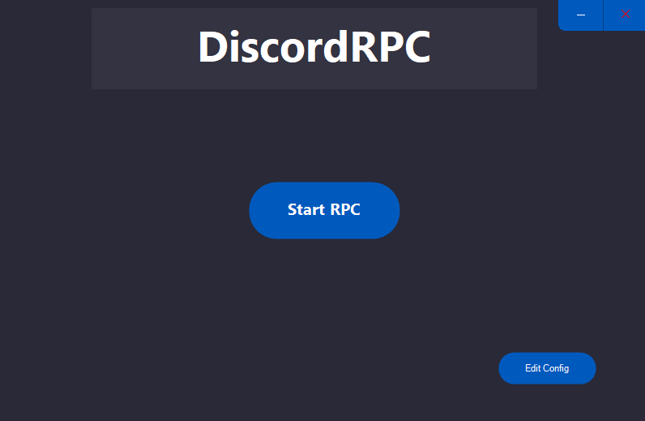
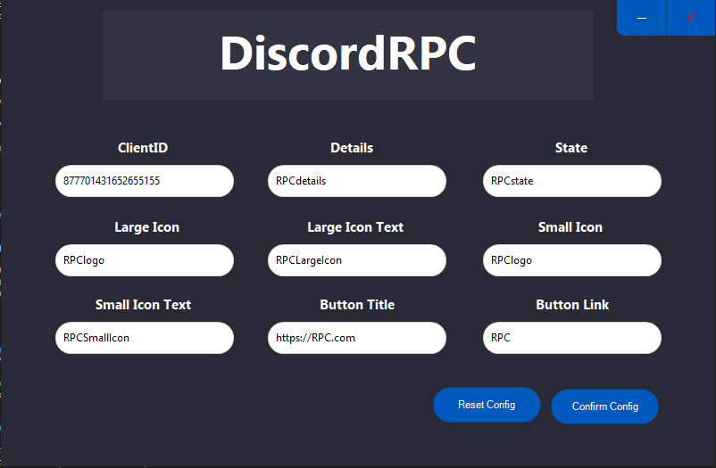

<h3 align="center">DiscordRPC</h3>

Simple DiscordRPC written in c#

### Screenshots

  
  

#### How to use
Add a value in for each element of in the rpc creater, hit save and start it!

#### Contributing
If you have any idea how to make this app better, please [create a pull request](https://github.com/JaredWestley/DiscordRPC/compare). If you find any bug, please [create an issue](https://github.com/JaredWestley/DiscordRPC/issues/new).

#### License
This project is licensed under an MIT license. Please check [LICENSE](LICENSE).
